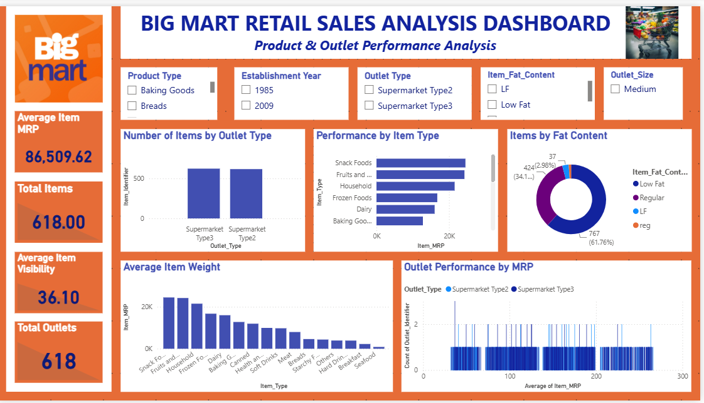

# Big Mart Sales Analysis Dashboard | Power BI

## Project Overview

This project was completed as part of my **Data Visualization Internship at Sysslan IT Solutions**.

The project focuses on analyzing Big Mart retail data using Microsoft Power BI. The dashboard provides insights into product characteristics, item MRP, item visibility, item types, fat content, outlet types, outlet locations, outlet sizes, and other retail-related information through interactive visualizations and filters.

---

# Table of Contents

- [Project Overview](#project-overview)
- [Internship Details](#internship-details)
- [Project Objective](#project-objective)
- [Dataset](#dataset)
- [Tools Used](#tools-used)
- [Dashboard Features](#dashboard-features)
- [KPI Analysis](#kpi-analysis)
- [Interactive Filters](#interactive-filters)
- [Files Included](#files-included)
- [Key Analysis Areas](#key-analysis-areas)
- [Skills Demonstrated](#skills-demonstrated)
- [Dashboard Preview](#dashboard-preview)
- [Internship Task Information](#internship-task-information)
- [Author](#author)
- [Connect With Me](#connect-with-me)
- [Organization](#organization)

---

## Internship Details

**Organization:** Sysslan IT Solutions

**Internship Role:** Data Visualization Intern

**Domain:** Data Visualization

**Internship Period:** 26/07/2026 – 26/08/2026

**Mode:** Remote

**Assigned Task:** Big Mart Sales Analysis using Power BI

---

## Project Objective

The objective of this project is to analyze Big Mart retail data and create an interactive Power BI dashboard that presents useful information about products and outlets.

The project focuses on transforming retail data into meaningful visual information that can support data analysis and decision-making.

---

## Dataset

The Big Mart dataset contains product-level and outlet-level information.

### Main Dataset Fields

- Item Identifier
- Item Fat Content
- Item MRP
- Item Type
- Item Visibility
- Item Weight
- Outlet Establishment Year
- Outlet Identifier
- Outlet Location
- Outlet Size
- Outlet Type

---

## Tools Used

- Microsoft Excel
- Microsoft Power BI
- Power Query
- Data Cleaning
- Data Analysis
- Data Visualization
- Dashboard Development

---

## Dashboard Features

The Power BI dashboard includes:

- Item Type Analysis
- Outlet Type Analysis
- Item MRP Analysis
- Item Visibility Analysis
- Fat Content Analysis
- Outlet Performance Analysis
- Product Details
- KPI Cards
- Interactive Slicers
- Data Filtering
- Dashboard Visualization

---

## KPI Analysis

The dashboard includes KPI cards for important summary information.

### KPIs Included

- Total Items
- Total Outlets
- Average Item MRP
- Average Item Visibility
- Average Item Weight

These KPIs provide a quick overview of important values in the Big Mart dataset.

---

## Interactive Filters

Interactive slicers are included in the dashboard to allow users to filter and explore the data.

### Slicers Included

- Item Type
- Outlet Type
- Item Fat Content
- Outlet Location
- Outlet Size

These filters allow users to explore specific categories and outlet characteristics.

---

## Files Included

- `BIG MART SALES ANALYSIS.pbix`
- `Big Mart Sales Analysis — Power BI Internship.pptx`
- `Big Mart Sales Analysis Internship Project Report.pdf`
- `Dashboard.png`

---

## Key Analysis Areas

The project analyzes the following areas:

### Product Analysis

Analysis of different product types, fat content, MRP, visibility, and weight.

### Outlet Analysis

Comparison of different outlet types, outlet locations, outlet sizes, and outlet establishment information.

### MRP Analysis

Analysis of Item MRP across different product and outlet categories.

### Item Visibility Analysis

Analysis of product visibility across different categories and outlets.

### Fat Content Analysis

Analysis of the distribution of products according to their fat-content categories.

### Outlet Type Analysis

Comparison of items and MRP across different outlet types.

---

## Skills Demonstrated

- Microsoft Excel
- Microsoft Power BI
- Power Query
- Data Cleaning
- Data Preparation
- Data Analysis
- Data Visualization
- KPI Development
- Dashboard Design
- Interactive Slicers
- Business Intelligence
- Data Presentation

---
## Internship Documentation

I was selected for the **Data Visualization Intern** role at **Sysslan IT Solutions**.

The internship offer letter is included in this repository:

📄 [View Internship Offer Letter](Sysslan_Internship_Offer_Letter_Santoshi_Pandalwad.pdf)
## Dashboard Preview

---

## Internship Task Information

This project was assigned as part of my internship at **Sysslan IT Solutions**.

I was selected for the role of **Data Visualization Intern** and was assigned a data visualization task as part of the internship.

The internship task required the preparation and analysis of data and the development of a Power BI visualization/dashboard.

### Internship Information

**Organization:** Sysslan IT Solutions

**Role:** Data Visualization Intern

**Domain:** Data Visualization

**Internship Period:** 26/07/2026 to 26/08/2026

**Mode:** Remote

The internship communication stated that successful completion of the assigned tasks would be considered completion of the internship.

---

## Internship Task Submission

The completed project files were prepared for submission according to the internship task requirements.

The submission includes:

- Power BI project
- Project report
- PowerPoint presentation
- Dashboard screenshot

The project demonstrates the completed data visualization work using Power BI.

---

## About Sysslan IT Solutions

Sysslan IT Solutions provided the internship opportunity and assigned the Data Visualization internship task.

**Website:** https://sysslan.com

**LinkedIn:** https://www.linkedin.com/company/sysslan-it-solutions/

**Email:** support@sysslan.com

---

## Author

**Santoshi Pandalwad**

Aspiring Data Analyst

### Skills

- Microsoft Excel
- Microsoft Power BI
- Power Query
- Data Cleaning
- Data Analysis
- Data Visualization
- Dashboard Development
- Business Intelligence

---

## Connect With Me

### LinkedIn

[Add your LinkedIn profile link here]

### GitHub

[Add your GitHub profile link here]

### Gmail

sanpandalwad@gmail.com

---

## Acknowledgement

I would like to thank **Sysslan IT Solutions** for providing me with the opportunity to work on this internship project and gain practical experience in data visualization and Power BI.

---

## Support

If you found this project useful, please consider giving this repository a ⭐.

Thank you for visiting my GitHub repository!
